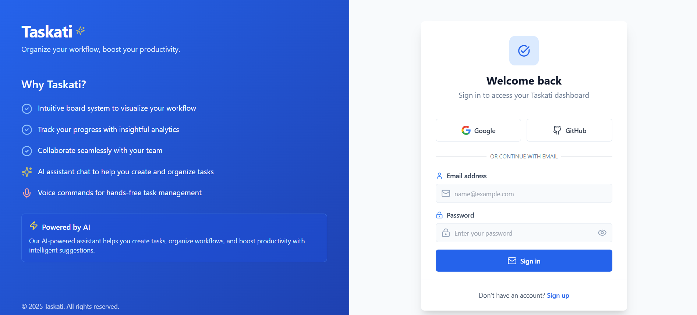
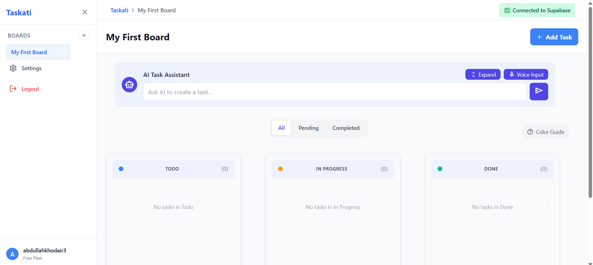
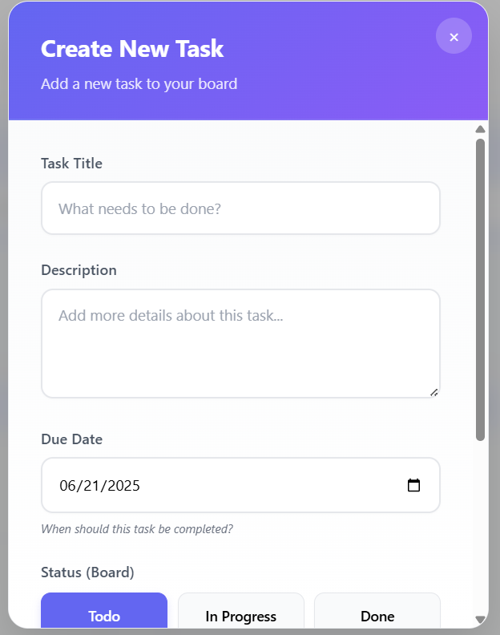
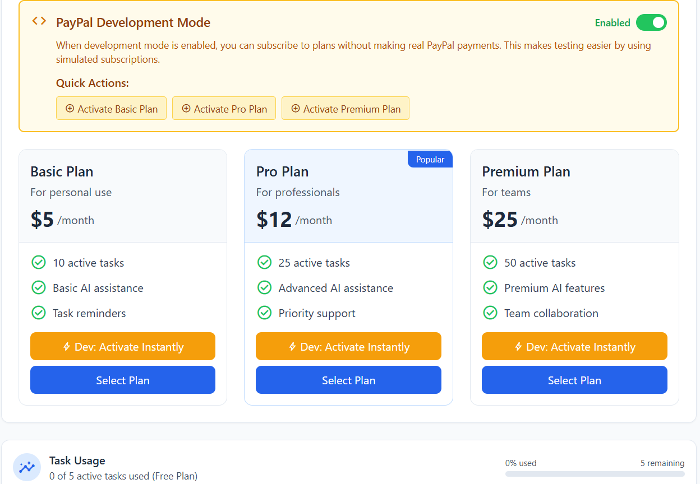

# Taskati - Modern Kanban Task Manager


Taskati is a modern, responsive Kanban task management application built with React, TypeScript, and Supabase. Organize your tasks with an intuitive drag-and-drop interface, AI-powered task suggestions, and real-time updates.

## 🚀 Features

- **Kanban Board**: Visual task management with drag-and-drop functionality
- **AI-Powered**: Get smart task suggestions using OpenAI
- **Real-time Sync**: Powered by Supabase for seamless collaboration
- **Responsive Design**: Works on desktop and mobile devices
- **Dark Mode**: Eye-friendly dark theme
- **Task Organization**: Categorize tasks with labels, priorities, and due dates
- **User Authentication**: Secure sign-up and login
- **Subscription Plans**: Multiple plans with different task limits

## 🛠️ Tech Stack

- **Frontend**: React 18, TypeScript, Vite
- **Styling**: Tailwind CSS, CSS Modules
- **State Management**: React Context API
- **Backend**: Supabase (Auth, Database, Storage)
- **AI**: OpenAI API
- **Payments**: PayPal Integration
- **UI Components**: Radix UI, Lucide Icons

## 🚀 Getting Started

### Prerequisites

- Node.js (v16 or later)
- npm or yarn

### Installation

1. **Clone the repository**
   ```bash
   git clone https://github.com/abdullahghonaiem/Taskati.git
   cd Taskati
   ```

2. **Install dependencies**
   ```bash
   npm install
   # or
   yarn install
   ```

3. **Start the development server**
   ```bash
   npm run dev
   # or
   yarn dev
   ```

5. **Open in browser**
   Visit `http://localhost:5173`

## 📸 Screenshots

### Login Page


### Boards Overview


### Task Creation


### Payment Integration


## 📂 Project Structure

```
src/
├── components/       # Reusable UI components
├── lib/              # Utility functions and services
├── services/         # API and service integrations
├── styles/           # Global styles and themes
└── App.tsx          # Main application component
```

## 🤝 Contributing

Contributions are welcome! Please follow these steps:

1. Fork the repository
2. Create your feature branch (`git checkout -b feature/AmazingFeature`)
3. Commit your changes (`git commit -m 'Add some AmazingFeature'`)
4. Push to the branch (`git push origin feature/AmazingFeature`)
5. Open a Pull Request

## 📄 License

This project is licensed under the MIT License - see the [LICENSE](LICENSE) file for details.

## 🙏 Acknowledgments

- [Vite](https://vitejs.dev/) for the amazing build tooling
- [Supabase](https://supabase.com/) for the awesome backend
- [Tailwind CSS](https://tailwindcss.com/) for the utility-first CSS framework
- [Radix UI](https://www.radix-ui.com/) for accessible UI primitives

---

Made with ❤️ by [Your Name]
    // Optionally, add this for stylistic rules
    ...tseslint.configs.stylisticTypeChecked,
  ],
  languageOptions: {
    // other options...
    parserOptions: {
      project: ['./tsconfig.node.json', './tsconfig.app.json'],
      tsconfigRootDir: import.meta.dirname,
    },
  },
})
```

You can also install [eslint-plugin-react-x](https://github.com/Rel1cx/eslint-react/tree/main/packages/plugins/eslint-plugin-react-x) and [eslint-plugin-react-dom](https://github.com/Rel1cx/eslint-react/tree/main/packages/plugins/eslint-plugin-react-dom) for React-specific lint rules:

```js
// eslint.config.js
import reactX from 'eslint-plugin-react-x'
import reactDom from 'eslint-plugin-react-dom'

export default tseslint.config({
  plugins: {
    // Add the react-x and react-dom plugins
    'react-x': reactX,
    'react-dom': reactDom,
  },
  rules: {
    // other rules...
    // Enable its recommended typescript rules
    ...reactX.configs['recommended-typescript'].rules,
    ...reactDom.configs.recommended.rules,
  },
})
```

# Taskati - Task Management Application

A React-based task management board for organizing your workflow.

## Environment Setup

This application requires Supabase for data storage. You need to set up the following environment variables:

### Supabase Configuration

Create a `.env` file in the root of the project with the following variables:

```
VITE_SUPABASE_URL=your_supabase_project_url
VITE_SUPABASE_ANON_KEY=your_supabase_anon_key
```

You can find these values in your Supabase project dashboard under Project Settings > API.

## Development

To start the development server:

```npm run dev
```

The application will be available at http://localhost:5181 or another port if 5181 is already in use.

